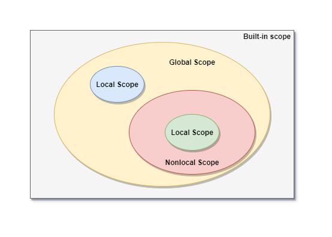

[toc]

# Python Scopes



- Following are the types of scopes in Python:
  - Built-in scope	
  - Global
  - Nonlocal
  - Local

- If you reference a variable in python, it tries to look for that variable in the current scope
- If it is unable to find the variable, then it looks for it in the **enclosing** scope 


### Built-In Scope

- The built-in objects are available everywhere in the module
- `True`, `False`, `None`, `dict` and `print` are the built-in objects which are available in global as well as the local scope


### Global Scope

- It is essentially the scope of the module (`*.py`)
- It spans a single file
- Global scope is nested inside the built-in scope


### Nonlocal Scope

- When we have two nested functions viz. `outer()` and `inner()`, the local scope is the scope of the inner function
- The module scope is called as Global scope
- Thus the scope of the outer function becomes a nonlocal scope
- If nested functions exists, the local scope is nested inside the nonlocal scope


### Local Scope

- Every time a function is called, a local scope is created

- Whenever a variable is defined in a function or in a class, it is assigned to the local scope of the function or a class, once they are called


> **Note:** In closures, the free variables exists in the extended scope since the nonlocal scope is destroyed once the function is executed


---


# Python Closures

- In a nested function, when the `outer()` function return the `inner` instead of calling it, we get a free variable from the nonlocal scope of the `inner` function. This is called closure

- In the below example, `x` is in the nonlocal scope for the `inner` function. When we call `outer()` in the global scope, it returns `inner` function

- When we call this inner function, the variable `x` is a free variable from a extended scope since the scope of `outer` function is destroyed after the execution

  ```python
  def outer():
      x = "hello"
      
      def inner():
          nonlocal x
          print(x)
      
      return inner
  
  fn = outer()
  fn()
  ```

- This ability of closures to provide free variables can be used for various applications

- Closures are used to augment the functionality of a function


## Applications of Closures

### Timers

```python
def timer():
    """
    Closure to count time in seconds from the initialization of this closure
    :return: Function showing the elapsed time
    """
    start = perf_counter()

    def elapsed():
        """
        Calculate the elapsed time since the function was first called
        :return: Elapsed time from initialization
        """
        return perf_counter() - start
    return elapsed
```


### Average

```python

def average():
    """
    Closure to return average of numbers entered in the closure
    :return: `add` function to all a number to the list
    """
    numbers = []

    def add(number):
        """
        Function to intake a value and find average with all the previous values
        :param number: Number to be added to the list
        :return: Average of all the numbers entered in the closure
        """
        nonlocal numbers
        numbers.append(number)
        total = sum(numbers)
        count = len(numbers)
        return total/count
    return add
```


---


# Code

- Following code blocks are in `closures.py`
- These are various application of the Closures


### Docstring Checker

- In this application, `threshold_value` is the free variable
- Whenever a function is passed to the `docstring_checker`, this closure will check if docstring is present in the passed function

```python
def docstring_checker(func, threshold):
    """
    Docstring checker Closure
    :param func: Input function
    :param threshold: Number of character needed in the docstring
    :return: Inner function to check the docstring content length
    """
    threshold_value = threshold

    def inner():
        """
        Inner function for the closure
        :return: Boolean True if docstring characters are greater than the `threshold`
        """
        func_docstring = func.__doc__
        if func_docstring is not None:
            func_docstring = "".join(func_docstring.split())
            if len(func_docstring) > threshold_value:
                return True
            return False
        return False
    return inner
```


### Fibonacci Number Generator

- This closure will generate the next number in the Fibonacci series
- Free variables used in this closure are `num1`, `num2`, and `count`

```python
def fib_generator():
    """
    Closure for Fibonacci series generator
    :return: Inner function which returns next fibonacci number
    """
    num1 = 1
    num2 = 1
    count = 0

    def inner():
        """
        Function to generate next Fibonacci number
        :return: Fibonacci number
        """
        nonlocal num1, num2, count
        count += 1

        if count < 3:
            return 1
        num1, num2 = num2, operator.add(num1, num2)
        return num2
    return inner
```


### Function Call Counter

- In this application, a global dictionary is used to keep a record of number of times a function is called
- The free variable used in this closure is `count`

```python
def function_call_counter(func):
    """
    Closure to count the number of times a function is called
    :param func: Function whose calls are counted
    :return: Inner function of the closure
    """
    count = 0

    def inner(*args, **kwargs):
        """
        Inner function of a closure which adds the function and it's count number to the dictionary
        :return: output of the function
        """
        nonlocal count
        global COUNTER
        count += 1
        print(f'Function {func.__name__} has been called {count} times')
        COUNTER[func.__name__] = count
        return func(*args, **kwargs)
    return inner
```


### Function Call Counter with Dictionaries

- In this application, separate dictionary is used for each function
- Whenever a function is called, the call counter is updated in the dictionary associated with that function

```python
def function_call_counter_(func, dict_name):
    """
    Closure to count the number of times a function is called
    :param func: Function whose calls are counted
    :param dict_name: Dictionary which stores the number of time function is called
    :return: Inner function of the closure
    """
    count = 0

    def inner(*args, **kwargs):
        """
        Inner function of the closure which adds function calls to the dictionary
        :return: Output of the function called with input arguments
        """
        nonlocal count
        count += 1
        print(f'Function {func.__name__} has been called {count} times')
        dict_name[func.__name__] = count
        return func(*args, **kwargs)
    return inner
```


---


# Test Cases

- The test cases for above closures are written in the `test_closures.py`
- Following is the information related to the test cases


### Docstring Checker

- Test cases associated with this closure are included in the `TestDocstring` class
- Following are the test cases:

| Test Case                                     | Description                                                  |
| --------------------------------------------- | ------------------------------------------------------------ |
| `test_docstring_checker_add`                  | Test case for the function `_add()` which has docstring of more than 50 characters |
| `test_docstring_checker_perf_counter`         | Test case for the function `perf_counter` which has docstring of less than 100 characters |
| `test_docstring_checker_no_docstring`         | Test case for a function without docstring named `some_function_without_docstring` |
| `test_docstring_checker_no_docstring_content` | Test case for a function without docstring named `some_function_without_content` |


### Fibonacci Number Generator

- Test cases associated with this closure are included in the `TestFibGen` class
- Following are the test cases:

| Test Case                | Description                                                  |
| ------------------------ | ------------------------------------------------------------ |
| `test_fib_10_digits`     | Test case to check if first 10 digits of Fibonacci series are printed correctly |
| `test_fib_third_element` | Test case to check if the 3rd element of Fibonacci series is correct |


### Function Call Counter

- Test cases associated with this closure are included in the `TestCounterClosure` class
- Following are the test cases:

| Test Case                                 | Description                                                  |
| ----------------------------------------- | ------------------------------------------------------------ |
| `test_call_counter_add_acceptable_data`   | Test Case to check if dictionary return correct number of calls for _add function |
| `test_call_counter_add_unacceptable_data` | Test Case to check if dictionary return correct number of calls for _add function for the unacceptable inputs |
| `test_call_counter_mul_acceptable_data`   | Test case to check the correct counter update with acceptable datatype for `_mul` function |
| `test_call_counter_mul_unacceptable_data` | Test case to check the correct counter update with unacceptable datatype for` _mul` function |
| `test_call_counter_div_acceptable_data`   | Test case to check the correct counter update with acceptable datatype for `_div` function |
| `test_call_counter_div_unacceptable_data` | Test case to check the correct counter update with unacceptable datatype for `_div` function |


### Function Call Counter with Dictionaries

- Test cases associated with this closure are included in the `TestModifiedCounter` class
- Following are the test cases:

| Test Case                        | Description                                                  |
| -------------------------------- | ------------------------------------------------------------ |
| `test_dictionary`                | Test if dictionary is passed or not                          |
| `test_counter_add`               | Check if the dictionary is updated properly for the `_add` function |
| `test_counter_mul`               | Check if the dictionary is updated properly for the `_mul` function |
| `test_counter_div`               | Check if the dictionary is updated properly for the `_div` function |
| `test_docstring`                 | Check if docstring is present for the closure functions      |
| `test_output_of_outer_and_inner` | Test case to check the output of the `outer` and `inner` function are valid |

# PythonClosures
